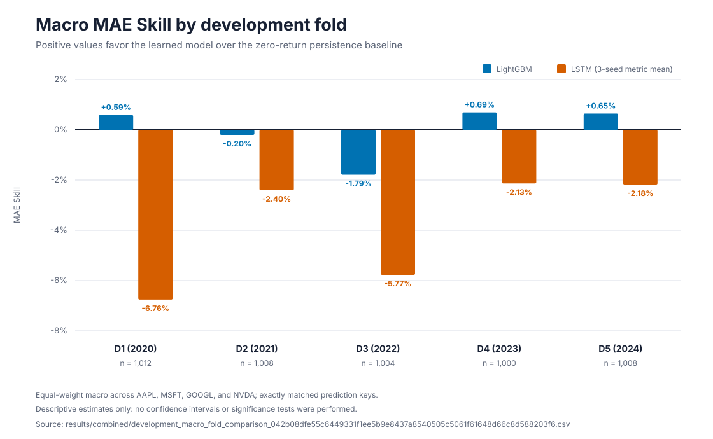
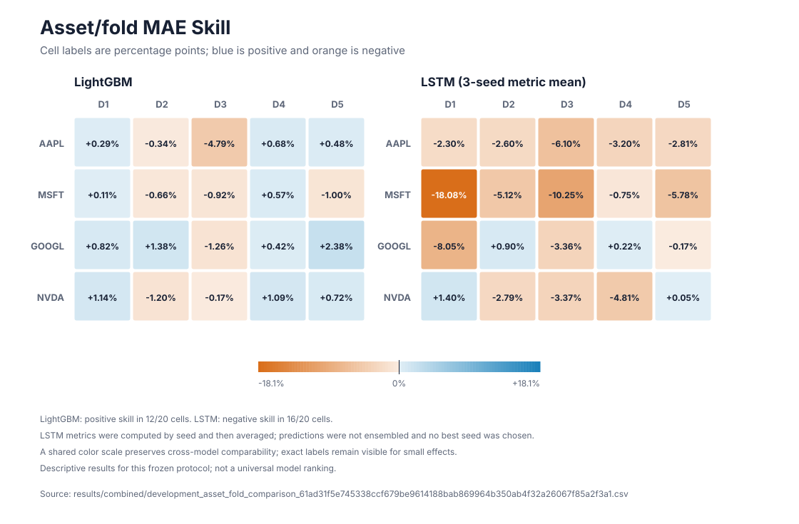
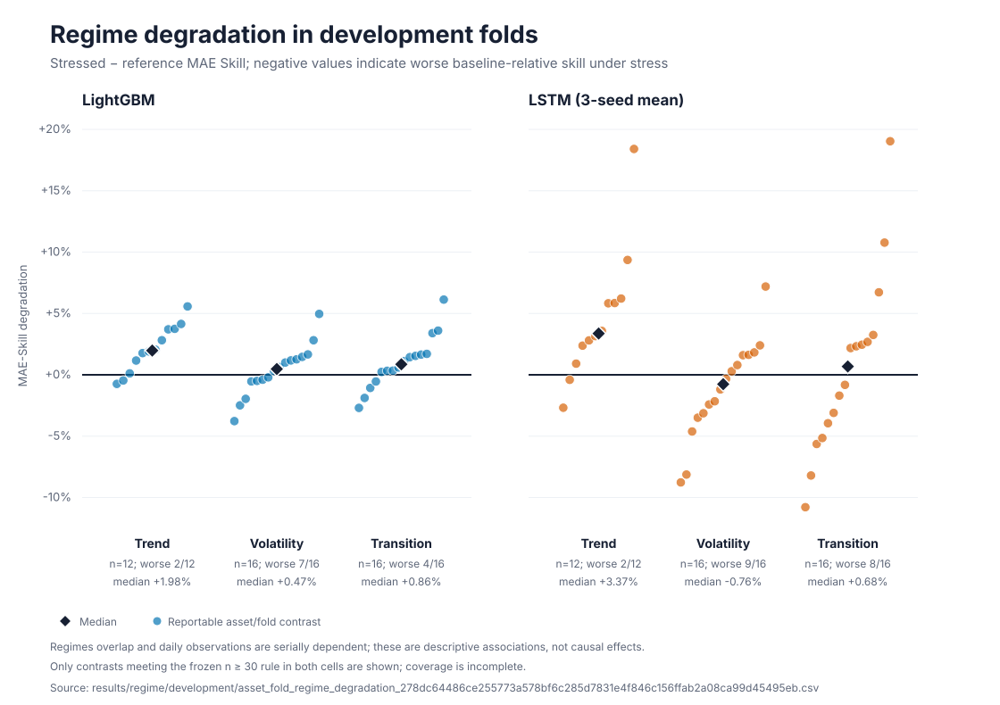
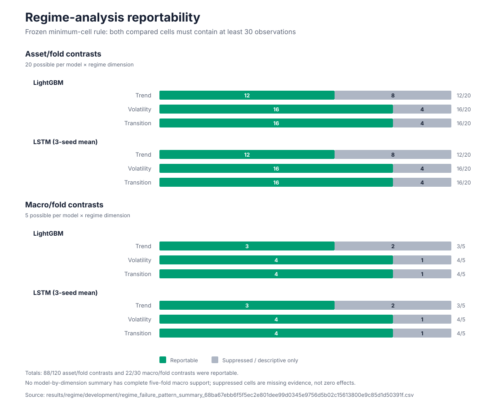

# D1–D5 development figures

These four SVG figures are presentation views of frozen, content-addressed **development** artifacts. They contain no F1/2025 performance results. The renderer does not train models, run inference, prepare data, or regenerate predictions.

## Generate and validate

From the repository root:

```bash
python docs/figures/generate_figures.py
```

The script uses only the Python standard library. Before writing any figure, it validates the SHA-256 digest encoded in each source filename, the required column schema, row counts, exact fold/asset keys, and headline reportability totals. Outputs are deterministic SVG files suitable for GitHub rendering and scalable publication layouts.

## Figures and provenance

### `macro_mae_skill_by_fold.svg`



Source: [`results/combined/development_macro_fold_comparison_042b08dfe55c6449331f1ee5b9e8437a8540505c5061f61648d66c8d588203f6.csv`](../../results/combined/development_macro_fold_comparison_042b08dfe55c6449331f1ee5b9e8437a8540505c5061f61648d66c8d588203f6.csv)

Equal-weight macro MAE Skill for the 2020–2024 development folds. Positive values favor the learned model over zero-return persistence. The `n` labels are pooled asset-row counts; the macro statistic gives each of the four assets equal weight. LSTM values are means of metrics calculated separately for three seeds, not metrics of averaged predictions. The bars are descriptive estimates, not confidence intervals.

### `asset_fold_mae_skill.svg`



Source: [`results/combined/development_asset_fold_comparison_61ad31f5e745338ccf679be9614188bab869964b350ab4f32a26067f85a2f3a1.csv`](../../results/combined/development_asset_fold_comparison_61ad31f5e745338ccf679be9614188bab869964b350ab4f32a26067f85a2f3a1.csv)

Twenty asset/fold cells per model are shown without constructing a new across-fold mean. The two panels use the same zero-centered color scale, and exact values are printed because several effects are small. LSTM metrics were computed separately by seed before averaging; no best seed or prediction ensemble is used. The result characterizes this frozen protocol, not a universal model ranking.

### `regime_mae_skill_degradation.svg`



Source: [`results/regime/development/asset_fold_regime_degradation_278dc64486ce255773a578bf6c285d7831e4f846c156ffab2a08ca99d45495eb.csv`](../../results/regime/development/asset_fold_regime_degradation_278dc64486ce255773a578bf6c285d7831e4f846c156ffab2a08ca99d45495eb.csv)

Only rows with `headline_reportable == True` are plotted. Degradation is stressed MAE Skill minus reference MAE Skill, so negative values mean worse baseline-relative skill under stress. Point counts are 12 for trend and 16 each for volatility and transition per model. Medians summarize available asset/fold contrasts; they are not complete five-fold estimates or inferential intervals. Regimes overlap and daily observations are serially dependent.

### `regime_reportability.svg`



Source: [`results/regime/development/regime_failure_pattern_summary_68ba67ebb6f5f5ec2e801dee99d0345e9756d5b02c15613800e9c85d1d50391f.csv`](../../results/regime/development/regime_failure_pattern_summary_68ba67ebb6f5f5ec2e801dee99d0345e9756d5b02c15613800e9c85d1d50391f.csv)

The chart exposes the effect of the frozen `n ≥ 30` rule instead of hiding incomplete coverage. Counts are model-contrast slots: 88/120 asset/fold slots and 22/30 macro/fold slots are reportable. Because both models share regime populations, summing their rows does not create additional unique sample coverage. Suppressed cells are missing evidence, not zero effects.

## Scientific boundary

All figure claims are traceable to the [publication claims ledger](../PUBLICATION_CLAIMS_LEDGER.md). The figures intentionally omit:

- confidence intervals or significance markers;
- causal interpretations of regime membership;
- trading, profitability, or risk claims;
- a PatchTST comparison, because no full benchmark was authorized; and
- any F1/2025 performance result, because the original final execution remains `INVALID_STOP_NO_RERUN`.
